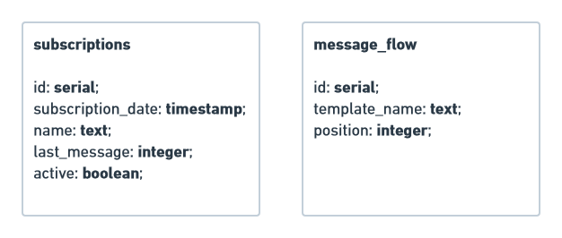

<h3 align="center">
  Desafio: Desenvolvedor back-end.
</h3>

  <a href="#rocket-sobre-o-desafio">Sobre o desafio</a>&nbsp;&nbsp;&nbsp;|&nbsp;&nbsp;&nbsp;
  <a href="#calendar-entrega">Entrega</a>&nbsp;&nbsp;&nbsp;

## :rocket: Sobre o desafio

Para você ja ir se aquecendo para o que está por vir, queremos propor um desafio para você.

Queremos que você implemente um servidor que receberá inscrições em um formulário. A partir das regras de negócio definidas, você precisará construir uma API REST que realize a inscrição, caso ela seja válida, deverá ser armazenado os dados em um banco de dados relacional.

**Inscrição no fluxo:** No sistema de captação de leads inbound temos um formulário de inscrição em um fluxo de mensagens com notícias e informações sobre os precatórios de nossos credores. Para isso, precisamos de uma API capaz de receber a inscrição pelo formulário e realizar o registro no banco de dados.

**Disparo de mensagens:** Também precisamos de um serviço periódico que seja executado uma vez ao dia, sempre no mesmo horário, para atualizar no banco de dados qual a última mensagem disparada para cada inscrição.

**Observação:** O desafio deve ser desenvolvido utilizando Javascript/Typescript. Fica a seu critério qual banco de dados utilizar, desde que faça sentido ao desafio proposto.

### Regras de negócio

**1 -** A inscrição só deve ser feita com um email válido.

**2 -** Não devem ser registradas linhas duplicadas com o mesmo email no banco de dados.

**3 -** A propriedade "position" da tabela "message_flow" indica o dia em que a mensagem deve ser enviada.

**4 -** A propriedade "last_message" da tabela "subscriptions" indica a última mensagem enviada para aquela inscrição.

**5 -** A propriedade "last_message" deve ser atualizada todos os dias com a próxima mensagem do fluxo.

**6 -** A propriedade "last_message" não deve ser atualizada em inscrições marcadas com "active" igual a "false".

**7 -** Caso a inscrição já tenha recebido todas as mensagens do fluxo, a propriedade "active" deve ser marcada como "false".

### Dados

Para te ajudar a entender um pouco melhor, essas são as três entidades necessárias para você resolver o seu desafio.

  

## :calendar: Entrega

Para entregar esse desafio você deve criar um repositório do GitHub contendo a sua implementação junto com as informações necessárias para rodar o seu projeto e enviar o link do mesmo para o email **dev.gi@precato.com.br**.
